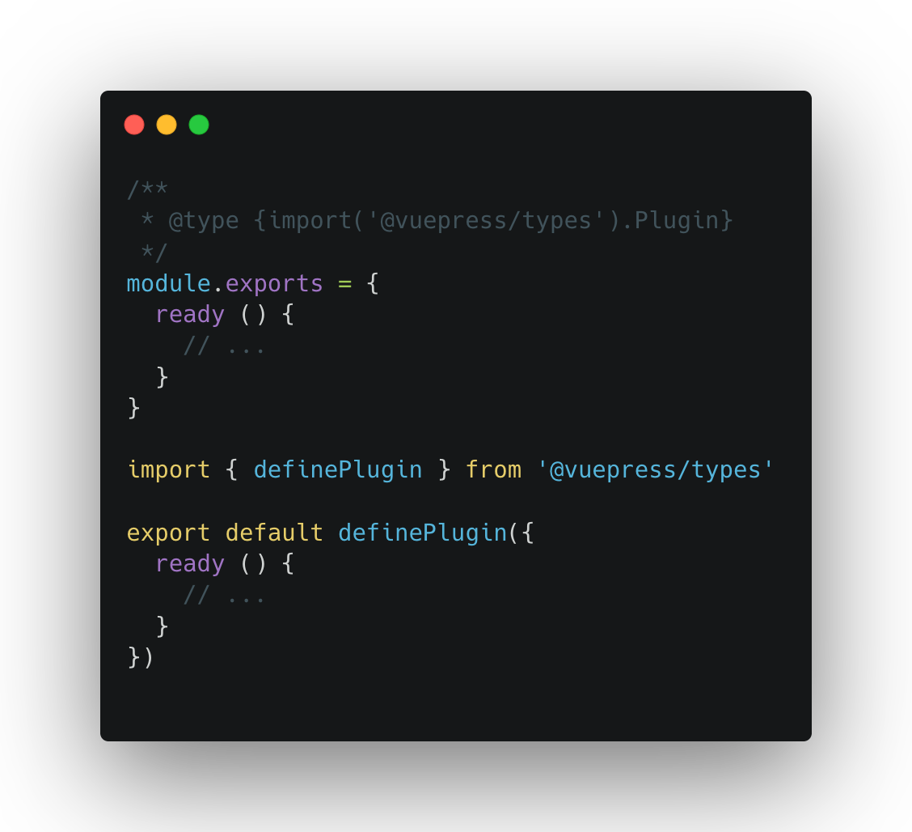

# TS Support for VuePress Plugin and Theme.

## Motivation

We've announced [VuePress 1.9](https://github.com/vuejs/vuepress/releases/tag/v1.9.0) that takes full TypeScript Support for Config File, while VuePress 1.9.2 ships with **TS Support for VuePress Plugin and Theme**:

<p align="center">
    </img>
<p>

## Quick Start

In order to make the plugin developer not dependent on VuePress for development, we provide a completely independent type package `@vuepress/types`:

```bash
npm i @vuepress/types -D
```

`@vuepress/types` exports four functions:

- `defineConfig`
- `defineConfig4CustomTheme`
- `defineTheme`
- `definePlugin`

Note that using `@vuepress/types` is equivalent to using `vuepress/config`.

## Plugin Type

If you already have some VuePress plugins written in JS, you can leverage your IDE's intellisense with jsdoc type hints:

```js
/**
 * @type {import('@vuepress/types').Plugin}
 */
module.exports = {
  ready() {
    // ...
  }
};
```

Alternatively, you can use the defineConfig helper which should provide intellisense without the need for jsdoc annotations:

```js
import { definePlugin } from "@vuepress/types";

export default definePlugin({
  // ...
});
```

## Plugin Options Type

Type of plugin options also supports passing in through generic type:

```ts
import { definePlugin } from "@vuepress/types";

interface Options {
  name: string;
}

export default definePlugin<Options>((options, ctx) => {
  return {
    ready() {
      return ctx.base + options.name;
    }
  };
});
```

## Theme Type

Similar to [plugin](plugin-type), the only difference is the type you use, and the define function:

```diff
 /**
- * @type {import('@vuepress/types').Plugin}
+ * @type {import('@vuepress/types').Theme}
  */
```

```diff
-import { definePlugin } from "@vuepress/types";
+import { defineTheme } from "@vuepress/types";

-export default definePlugin({
+export default defineTheme({
   // ...
 });
```

## Theme Config Type

Type of theme config also supports passing in through generic type:

```ts
import { defineTheme } from "@vuepress/types";

interface ThemeConfig {
  lang: string;
}

export default defineTheme<ThemeConfig>((themeConfig, ctx) => {
  return {
    ready() {
      return ctx.base + themeConfig.lang;
    }
  };
});
```

## Notes

It is worth noting that, unlike the [site configuration](https://vuepress.vuejs.org/config/), i.e. `.vuepress/config.js`, if you use TypeScript to write theme or plugin, you still need to compile it into JavaScript before publishing it to NPM.
